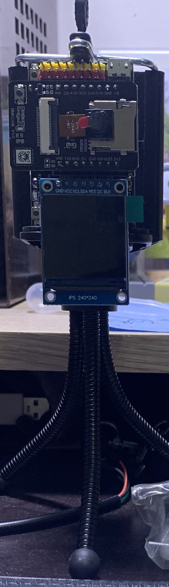
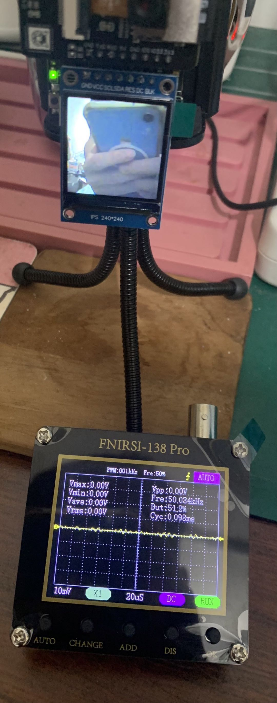

# esp32_easycam
* Camera web server: wifi streaming (Face detection & recognition)
* TFT_eSPI display & Real-time photo
* Line notify
* MQTT streaming, Websocket
* Teachable machine (google)

# reference [夜市小霸王]
* easycam url：https://shopee.tw/product/5742314/198...
* youtube: https://www.youtube.com/watch?v=T9J_hCg9OHk
* doc: https://twgo.io/ezcam
  

